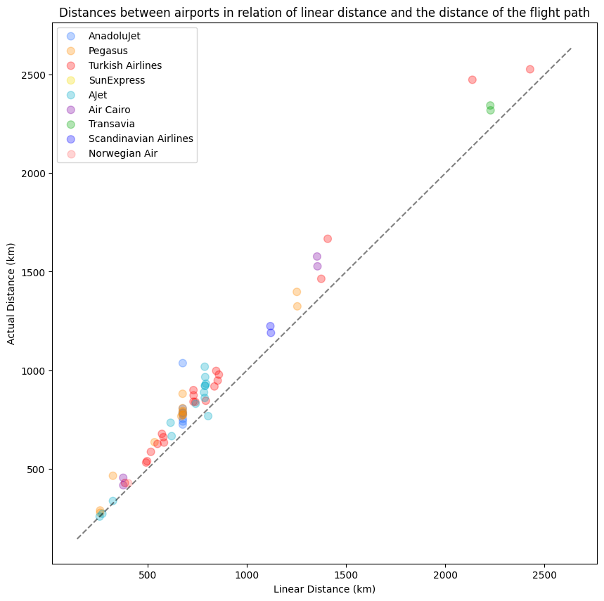
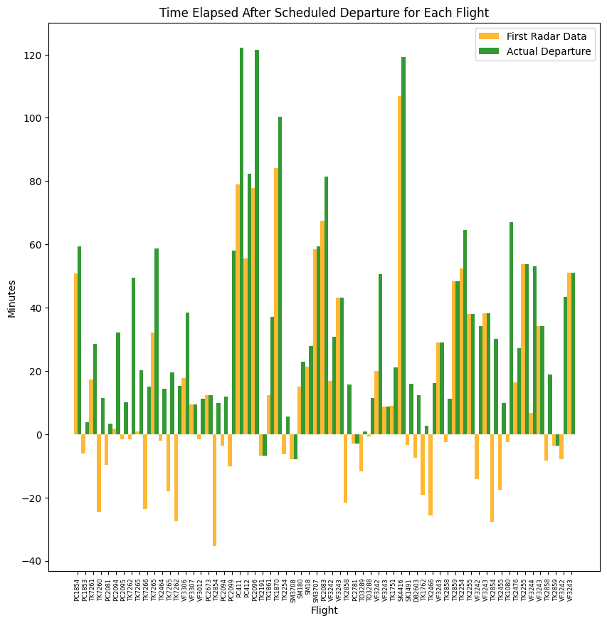
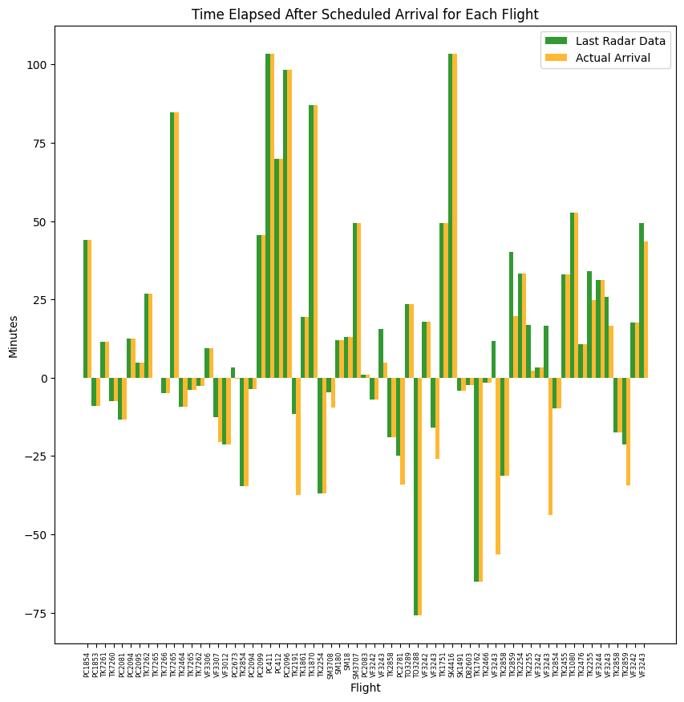
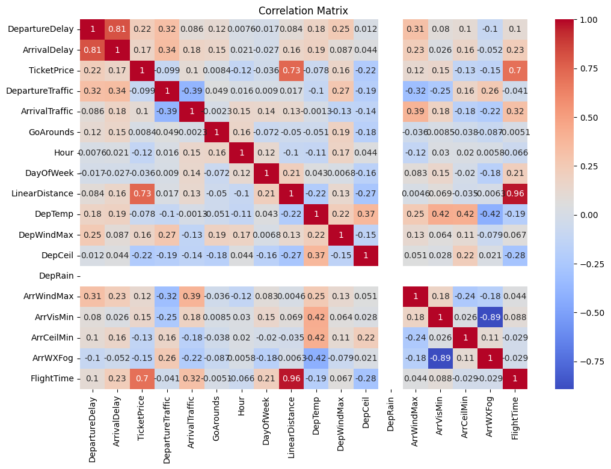
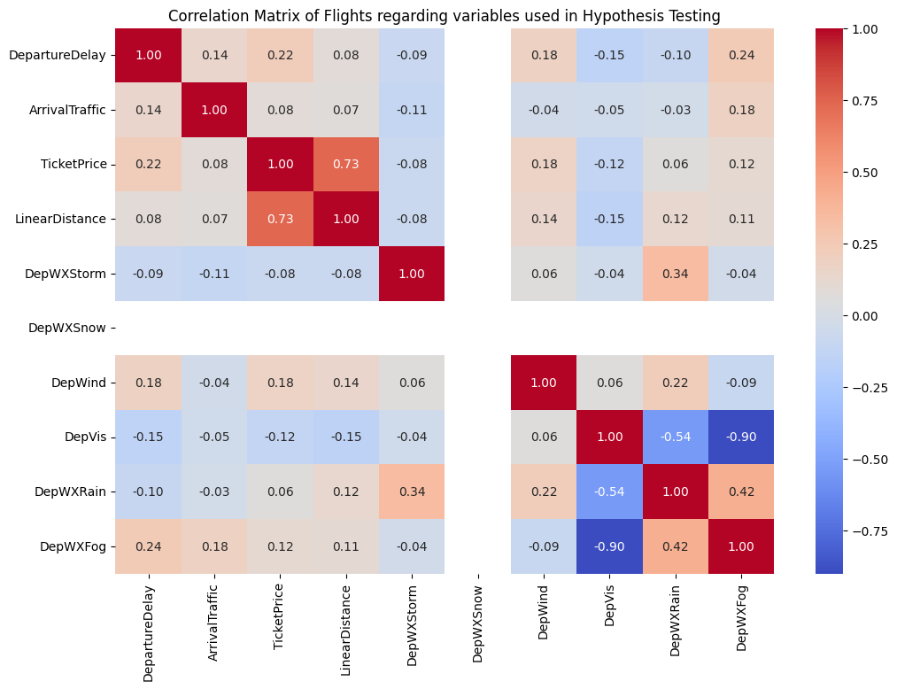

# Flight data analysis

> [!NOTE]
> This is a DSA210 project repository for university. This repository is only relevant to instructors and students who are teaching, learning, about to take or has taken this course.

Information and conclusions drawn from every single flight I've been with enriched details of each flight with older public flight details.

> [!NOTE]
> This file is a proposal and it is subject to change.

## Why?
Ever since starting university, I've become a frequent flier and I seemed to go on a bunch of flights especially since 2023. I've had an interesting idea of exploring all my past flights and their interesting events using as much data as possible. We are going to use the historical (and available) data that are on the flights I've been on to get an some sort of pattern on these flights.

## Data Sources
- [My flight logs on myFlightradar24](https://my.flightradar24.com/YouTube_101/flights) because I log my flights on that page
- [Historical flight data from Flightradar24](https://www.flightradar24.com/) to get accurate timings, route, aircraft, registration information, estimated traffic information for a specific flight.
- [METAR data from Iowa Environmental Mesonet](https://mesonet.agron.iastate.edu/request/download.phtml) for weather details around visited airports.
- Estimated ticket prices from my bank statements/memory.

> [!IMPORTANT]
> Despite there were 81 flights I've been on, If we discard the flights before 2023 due to the unavailability of data and discard a couple flights which weren't accurately tracked, we are left with 65 flights.

## Data Analysis
- Download all flight logs from Flightradar24
- Download the diary file in CSV format
- Parse the data into numbers and coordinates
- Match and merge all flight information into one dataset
- Visualize/graph merged dataset
- Answer hypotethical questions
- Create a model for predicting price/punctuality

## Data Visualisation

### 1. Distribution of flights based on Linear Path vs Actual Path

**Finding:** Flights are taking place in a most straight-ish line as possible. The higher on the y-axis the flight is on this graph, the more it spent time on the air near the arriving airport without landing.

### 2. Bar graph of flights' departure punctuality

**Finding:** The 'scheduled' departure time isn't as accurate as it sounds. Assuming most of the flights were not reported to the airport screens as 'delayed', on most flights, the aircraft starts up their transponders 10-30m after scheduled time and they depart the airport 15-45m after scheduled time.

### 3. Bar graph of flights' arrival punctuality

**Finding:** Comparing between this and the previous graph shows us that some airlines account a little more time on their 'scheduled' arrival time to make it sound that they arrive on time. However, most flights arrive and start the de-boarding process 10-40m after scheduled arrival time.

### 4. Corellation Matrix

**Finding:** There is a sufficient correlation between the ticket price and the linear distance along with the flight time. Most Items there are not as sufficient as usual.

## Hypothesis Testing

### Does weather affect my flights?
- **Null Hypothesis H₀:** There is no difference in departure delays between days with good weather and days with bad weather.
- **Alternative Hypothesis H₁:** There are longer delays on days with bad weather than days with good weather.
- **Method:** T-Test. Find the p value and reject the hypothesis if it's under 0.05
- **Result:** P-value: 0.53 - NOT SIGNIFICANT. Delays weren't caused by weather.

### Does air traffic affect my arrival delay?
- **Null Hypothesis H₀:** There is no difference in flight duration between flights on larger arrival traffic and on lower arrival traffic.
- **Alternative Hypothesis H₁:** The flights take longer to complete during larger arrival traffic than lower arrival traffic.
- **Method:** Pearson correlation. Check strength with Correlation. Find the correlation value and p value to and reject the hypothesis if it's below 0.05
- **Result:** Correlation: 0.23, P-value: 0.059 - MARGINALLY SIGNIFICANT. Traffic may cause arrival delays but it's not a trend.

> [!IMPORTANT]
> Some flights have stopped before reaching their final destinations due to insufficient coverage of Flightradar24 which may affect this decision of not rejecting this hypothesis

### Does distance affect my ticket price?
- **Null Hypothesis H₀:** Distance has no effect on my ticket prices.
- **Alternative Hypothesis H₁:** Longer flights were more expensive.
- **Method:** Linear regression. Find the slope, R-squared value and P-value. Reject the hypothesis if P-value is below 0.05
- **Variables:** Slope (Liras per kilometer): TRY2.47,
R-squared (% of ticket based on distance): 53%
- **Result:** P-value: 0.000000000003 - SIGNIFICANT. Distance is a reliable predictor of price.

> [!IMPORTANT]
> The prices were estimated from knowledge/bank statements/tour pricing for flights. The price includes everything I paid for.

### Correlation Matrix of variables used for this phase
